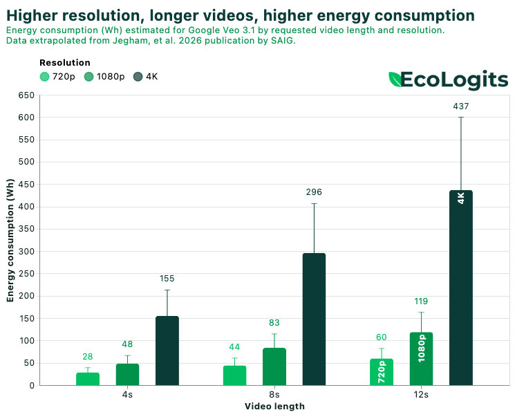

# AI Videos in EcoLogits

We are happy to release our first methodology for assessing the environmental footprint of **AI-generated videos**. This is a major step forward in modeling new GenAI use cases beyond text generation, and this contribution is part of the work pursued with the **GenAI footprint Alliance**.

The GenAI footprint Alliance is a [Publicis Groupe](https://www.publicisgroupe.com/en) initiative dedicated to the common good. Its goal is to quantify and share reliable data on the environmental footprint of GenAI models for content production, and to integrate this data into open source tools. The alliance is led by Publicis France's CSR team, AXA, Engie, and Groupe La Poste/La Banque Postale as founding members, with support from FDJ United, Accor, L'Oréal, Orange, and Renault Group as partner members.

The research behind this work was conducted by the [Sustainable AI Group](https://sustainableaigroup.com/) (SAIG) with [Sasha Luccioni](https://www.linkedin.com/in/sashaluccioniphd/), [Boris Gamazaychikov](https://www.linkedin.com/in/bgamazay/), and [Nidhal Jegham](https://www.linkedin.com/in/nidhal-jegham-b05840224/). The methodology was then operationalized in a corporate context through its integration into EcoLogits tools from [CodeCarbon](https://codecarbon.io) and the [e-footprint](https://e-footprint.boavizta.org/) modeling tool, developed by [Publicis Sapient](https://www.publicissapient.com/) France and open-sourced within [Boavizta](https://boavizta.org/en).

The GenAI footprint Alliance also contributes to the _Consortium IA durable_ supported by [ADEME](https://www.ademe.fr/). The _Consortium IA durable_ gathers [Institut Louis Bachelier](https://www.institutlouisbachelier.org/) and CodeCarbon.

## Why AI videos?

AI video-generation models are widely recognized as energy intensive. Academic work has discussed this growing concern, and recent studies on text-to-video systems show that video generation can be far more power-hungry than other modalities such as text or image generation, especially as duration and resolution increase ([Delavande, Pierrard, and Luccioni, 2025](https://arxiv.org/abs/2509.19222)). The discontinuation of OpenAI's Sora app in 2026 also highlighted the operational and economic challenges associated with scaling AI video generation.

At the same time, AI videos are now used across many industries, from social media content and professional film editing to customized online advertising. Models can generate longer videos, include audio tracks, and support high resolutions up to 4K, making them increasingly practical and versatile.

This growing diversity of use cases, combined with the environmental impact of each generated video, makes AI video generation highly relevant to address in EcoLogits today.

One key learning from this work is simple: **the more you ask, the greater the environmental impacts**. This depends not only on the number of videos generated, but also on the size of the model, the duration of the video, and the selected resolution.

## How do we estimate these impacts?

The environmental impacts are estimated using a bottom-up methodology, similar to the one we have already published and continue to maintain for text generation. A core part of the method is estimating the direct electricity consumption of the servers and infrastructure that support AI video models.

This is where SAIG's work is being integrated into EcoLogits. They developed benchmarks of open models to understand how generation latency for a single video can be estimated from the requested duration and resolution, as well as the model and infrastructure provider. Their academic paper is now available on arXiv: [Jegham et al. (2026)](https://arxiv.org/abs/2607.04553).

From the estimated electricity consumption and hardware use, we then deduce environmental impacts using a life cycle assessment approach. EcoLogits models provider data-center overhead and locations to estimate greenhouse gas emissions and water consumption during the use phase. It also accounts for hardware manufacturing impacts, reusing work from Boavizta, Hubblo, and academic research on AI hardware life-cycle impacts ([Schneider et al., 2025](https://arxiv.org/abs/2502.01671)).

You can read the full methodology on our dedicated [video generation methodology page](../../methodology/video_generation.md).

## Try it today

Impact estimations for AI videos are now available in all EcoLogits tools:

- the [EcoLogits Calculator](https://calculator.ecologits.ai/),
- the [EcoLogits Python library](../../tutorial/video_generation.md),
- and the [EcoLogits API](https://api.ecologits.ai/docs).

Try it on your own use cases, and feel free to share feedback with us directly on [Discord](https://discord.gg/CAecQ2zM4n) or through our [GitHub repositories](https://github.com/mlco2).

You can also try these estimations in the [e-footprint](https://e-footprint.boavizta.org/) tool, which integrates the latest version of EcoLogits. It lets you model more complex usage patterns, create your own scenarios, and explore how different choices increase or reduce environmental impacts.
