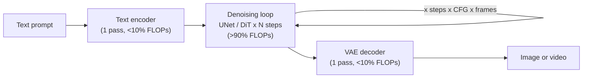
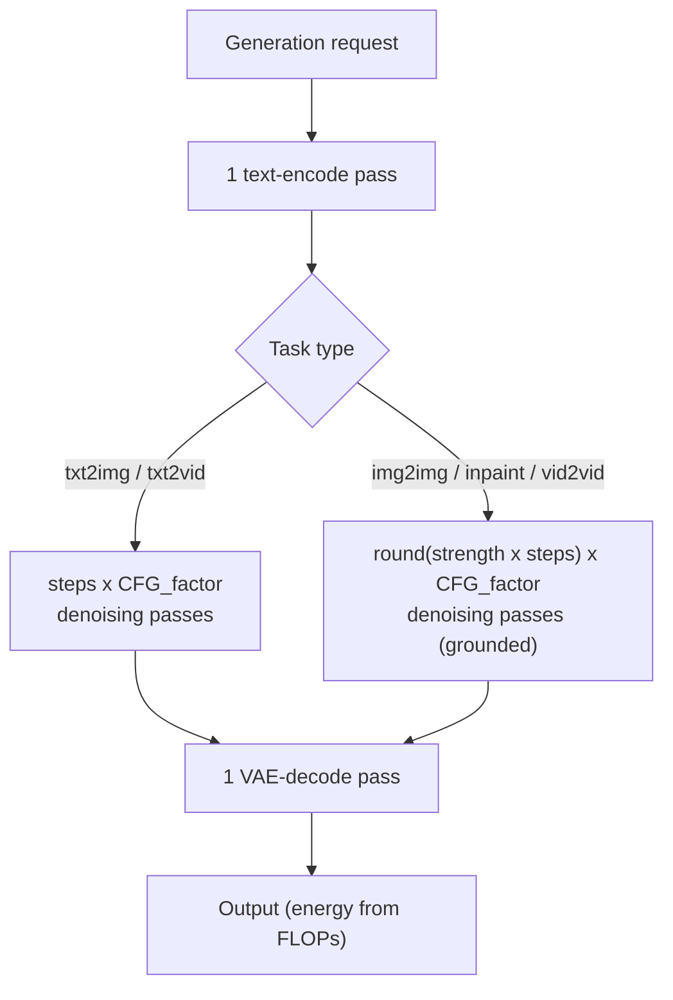
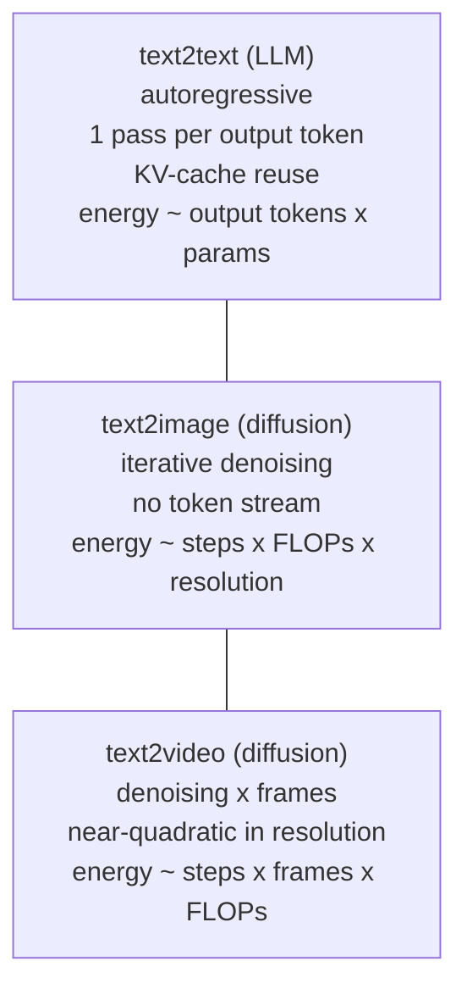

# Environmental Impacts of Diffusion Inference

## Introduction

This methodology extends EcoLogits to **image and video diffusion models** (text-to-image, image-to-image, inpainting, text-to-video and video-to-video). Like the [LLM inference](llm_inference.md) methodology, the environmental impacts of a request, $I_{\text{request}}$, are split into usage impacts $I_{\text{request}}^{\text{u}}$ and embodied impacts $I_{\text{request}}^{\text{e}}$:

$$
I_{\text{request}} = I_{\text{request}}^{\text{u}} + I_{\text{request}}^{\text{e}} = E_{\text{request}} \times F_{\text{em}} + \frac{\Delta T}{\Delta L} \times I_{\text{server}}^{\text{e}}.
$$

Everything **downstream of GPU energy** — server energy, PUE, electricity mix $F_{\text{em}}$, embodied impacts, WCF and the `RangeValue` approximation intervals — is **reused unchanged** from the LLM methodology. The diffusion-specific part is the way the **GPU energy** $E_{\text{GPU}}$ is estimated.

!!! note "This methodology also serves as the fallback for unbenchmarked video models."

    When a video model has no empirical latency regression in `video_models.json`, EcoLogits uses this FLOPs-based backend and attaches the `modality-video-flops-fallback` warning. See [Video Generation](video_generation.md) for the primary video methodology.

## Why FLOPs, not tokens

The LLM model keys energy off the number of output tokens and the number of active parameters via a regression of the form $f_E = \alpha e^{\beta B} P_{\text{active}} + \gamma$. This does not transfer to diffusion: there is **no token stream**. The energy of a diffusion request is driven by the number of **denoising steps**, the **resolution**, the **number of frames** (video) and the **FLOPs per denoising pass**, not by tokens.

The backbone is the validated scaling law from *Energy Scaling Laws for Diffusion Models* ([arXiv:2511.17031](https://arxiv.org/abs/2511.17031)), which reports $R^2 > 0.9$ across multiple GPUs and resolutions. The denoising loop dominates total compute, but the single text-encode and VAE[^vae]-decode passes together contribute 5–15% of pipeline FLOPs and are **not negligible**. They are accounted for via a pipeline overhead factor $\varphi$:

$$
\text{FLOPs}_{\text{total}} = \varphi \times T \times \text{FLOPs}_{\text{denoise}}, \qquad \varphi = 1.1,
$$

where $T$ is the number of denoising steps, $\text{FLOPs}_{\text{denoise}}$ is the cost of a single denoiser (U-Net or DiT) forward pass at the model native resolution, and $\varphi = 1.1$ is a conservative central estimate for the pipeline overhead (text encoder + VAE decoder). The actual overhead ranges from ~5% for models with a small CLIP encoder (SD 2.x) to ~15% for models with a large T5-XXL encoder (Flux, SD3). Classifier-free guidance (CFG[^cfg]) runs the denoiser twice per step (conditional + unconditional), so it doubles the denoising compute:

$$
\text{FLOPs}_{\text{cfg}} = \text{FLOPs}_{\text{total}} \times 2^{[\text{cfg}]},
$$

with $[\text{cfg}] = 1$ when guidance is on and $0$ otherwise. GPU energy is then modeled as a log-linear function of compute, resolution, numerical precision and accelerator:

$$
\log(E_{\text{GPU}}) = \log(A) + \alpha \log(\text{FLOPs}_{\text{cfg}}) + \beta_{\text{res}} \log\!\left(\frac{H \cdot W}{256}\right) + \beta_{\text{dtype}} + \beta_{\text{gpu}}.
$$

Here $H$ and $W$ are the output height and width in pixels, $A$ is a calibration constant, $\alpha$ the FLOPs elasticity, $\beta_{\text{res}}$ the residual resolution sensitivity not already captured by the FLOPs term, and $\beta_{\text{dtype}}$ / $\beta_{\text{gpu}}$ offsets for numerical precision and GPU model.

### Per-modality GPU energy

For **image** generation, the energy of producing $n_{\text{images}}$ images is the per-image energy multiplied by the image count. Multiple images from a single prompt are assumed to be generated **in series** (one full denoising pipeline per image, no shared context or KV-cache between outputs), so total energy scales linearly:

$$
E_{\text{GPU}}^{\text{image}} = n_{\text{images}} \times \exp\!\Big(\log(A) + \alpha \log(\text{FLOPs}_{\text{cfg}}) + \beta_{\text{res}} \log\!\big(\tfrac{H \cdot W}{256}\big) + \beta_{\text{dtype}} + \beta_{\text{gpu}}\Big).
$$

For **video** generation, the denoiser operates over the full spatiotemporal latent volume, so the per-step FLOPs grow with the frame count $N_f$. The frame budget is taken from `num_frames` or derived from `duration_s` $\times$ `fps`:

$$
N_f = \min\{\text{num\_frames},\ \text{duration\_s} \times \text{fps}\}.
$$

#### Frame attention scaling

The per-step FLOPs of a video denoiser have two distinct scaling regimes depending on architecture:

- **MLP / FFN layers** — cost scales **linearly** with the number of tokens, i.e., $\propto N_f$.
- **Full-sequence 3D attention** (used in HunyuanVideo, WAN, CogVideoX) — cost scales **quadratically**, i.e., $\propto N_f^2$, because every token attends to every other token across space *and* time.
- **Sparse / causal attention** (used in LTX-Video) — cost is closer to linear or sub-linear.

EcoLogits models this with a **mixed linear+quadratic frame scaling**:

$$
\text{frame\_scale}(N_f) = (1 - f) \cdot \frac{N_f}{N_f^{\text{default}}} + f \cdot \left(\frac{N_f}{N_f^{\text{default}}}\right)^2,
$$

where $N_f^{\text{default}}$ is the model's native clip length (from `models.json`), and $f \in [0, 1]$ is the **`frame_attn_fraction`**: the share of per-step FLOPs that come from full-sequence attention and therefore scale quadratically with frame count.

**Calibration of $f$.** For the three open video models present in both the FLOPs registry (`models.json`) and the empirical latency registry (`video_models.json`), $f$ was fitted by requiring the frame-count scaling curve of this model to match the ratio $E_{\text{PR}}(N_f) / E_{\text{PR}}(N_f^{\text{ref}})$ from the PR #240 latency-based backend, with $N_f^{\text{ref}}$ corresponding to a 2-second clip:

$$
f = \frac{x_{\text{tgt}} - r \cdot x_{\text{ref}}}{r \cdot (x_{\text{ref}}^2 - x_{\text{ref}}) - (x_{\text{tgt}}^2 - x_{\text{tgt}})}, \qquad r = \frac{E_{\text{PR}}(N_f^{\text{tgt}})}{E_{\text{PR}}(N_f^{\text{ref}})},
$$

where $x = N_f / N_f^{\text{default}}$ and the target point is an 8-second clip.

| Model | $N_f^{\text{default}}$ | Attention type | $f$ | Basis |
|-------|------------------------|----------------|-----|-------|
| HunyuanVideo | 129 | Full 3D attention | **0.64** | Empirically fitted |
| WAN2.1-T2V-14B / 1.3B | 81 | Full 3D attention | **0.54** | Empirically fitted |
| LTX-Video | 121 | Causal / sparse attention | **0.00** | Sub-linear; capped at 0 |
| CogVideoX-2b / 5b, Mochi-1 | — | DiT 3D attention | **0.50** | Architecture estimate |
| Closed video models | — | Unknown | **0.45–0.55** | Conservative estimate |
| Image models | — | No temporal attention | **0.00** | By definition |

**Effect.** Cross-validating against the PR latency backend at 720p, the PR/FLOPs energy ratio was **growing** from ~1.7× at 2 s to ~3.8× at 8 s before this correction (quadratic drift). After adding $f$, the ratio is **constant** at ~2.9× for HunyuanVideo and ~2.5× for WAN across all tested durations. The remaining constant gap reflects known attribution differences between the two methods (whole-machine DGX power allocation vs. per-GPU H100), not a scaling artefact.

!!! note "Limitation"

    The fitted $f$ values are derived from the empirical latency regressions in `video_models.json`, which are themselves modelled (latency empirical, power inferred from datasheets). Direct per-architecture FLOPs profiling is needed to replace these estimates with ground-truth attention fractions.

## Input taxonomy

The core deliverable of this page is making explicit **what the user provides** versus **what EcoLogits assumes**. Diffusion APIs expose far fewer knobs than the underlying model exposes, so most of the energy-driving parameters are extrapolated from documented defaults.

| Input | Source | Notes |
|-------|--------|-------|
| `provider` | **user-supplied** | Resolves the data-center PUE/WUE and default zone. |
| `model_name` | **user-supplied** | Resolves architecture, FLOPs and defaults from the model repository. |
| `task` | **user-supplied** | One of `txt2img`, `img2img`, `inpaint`, `txt2vid`, `vid2vid`. |
| `width`, `height` | **user-supplied** | Output resolution, drives the $H \cdot W$ term. |
| `n_images` | **user-supplied** (image) | Number of images requested. |
| `num_frames` or `duration_s` $\times$ `fps` | **user-supplied** (video) | Frame budget of the clip. |
| `denoising_strength` | **user-supplied** (editing only) | $0$–$1$, sets executed steps for `img2img` / `inpaint` / `vid2vid`. |
| `num_inference_steps` | **assumed** | Per-model/sampler default (e.g. 28–50; turbo/LCM 1–8). |
| `guidance_scale` / CFG | **assumed** | Default on $\Rightarrow$ $2\times$ denoise FLOPs. |
| FLOPs / parameter count | **assumed** | From the repository entry; closed models use a `RangeValue` from the nearest open proxy. |
| `quantization_bits` $= 16$ | **assumed** | Inherited unchanged from the LLM methodology. |
| `gpu_memory` $= 80$ GB (H100) | **assumed** | Inherited unchanged from the LLM methodology. |
| `batch_size` $= 1$ (range $1$–$4$) | **assumed** | The only diffusion-specific change vs. the LLM default of 64. |
| PUE / WUE / electricity mix | **assumed** | From `PROVIDER_CONFIG_MAP` and the zone. |

!!! note "Why `batch_size = 1`?"

    High-resolution latents are memory-heavy, so production image and video pipelines run with very small batches (typically 1–4) rather than the LLM default of 64. Assuming 64 would under-count both per-request energy and embodied-impact allocation by up to ~64×. We therefore model `batch_size` as `RangeValue(1, 4)`. Quantization (16-bit) and GPU (80 GB H100) are left **unchanged** from the LLM methodology.

## Editing tasks: grounded steps, unvalidated energy

Editing tasks (`img2img`, `inpaint`, `vid2vid`) must be treated carefully, because two very different claims are at play and only one of them is validated.

**What is grounded.** The *executed-step count* is real, documented pipeline behavior. The diffusers `img2img`, `inpaint` and `vid2vid` pipelines[^sdedit] add noise only up to timestep `strength × steps` and then run **exactly** that many denoising passes:

$$
T_{\text{eff}} = \operatorname{round}(\text{strength} \times T).
$$

This is not an assumption — it is how the schedulers are implemented ([source](https://github.com/huggingface/diffusers/blob/main/src/diffusers/pipelines/stable_diffusion/pipeline_stable_diffusion_img2img.py)). A `strength = 0.5` `img2img` request genuinely runs half the denoising passes of the equivalent `txt2img` request.

**What is unvalidated.** The *end-to-end energy mapping* of editing is **not** validated:

- the **input-encode overhead** (VAE-encode of the source image, or of every source frame for `vid2vid`) is not measured;
- the **per-step energy parity** with `txt2x` is uncertain — inpainting masks and ControlNet / reference passes can change the cost of a step;
- there is **no direct energy measurement** of these workflows in the source benchmarks.

Because the step count is grounded but the energy mapping is not, EcoLogits does **not** return a point estimate for editing. It returns a flagged `RangeValue` bounded below by the strength-scaled estimate and above by the full `txt2x` energy:

$$
E_{\text{GPU}}^{\text{edit}} = \text{RangeValue}\big(E_{\text{GPU}}(T_{\text{eff}}),\ E_{\text{GPU}}(T)\big),
$$

and attaches the `modality-editing-unvalidated` warning so consumers know the interval reflects methodological uncertainty, not just parameter uncertainty.

## Architecture-to-FLOPs map

The diagram below shows where compute is spent in a diffusion pipeline. The text encoder and the VAE decoder each run **once** and contribute under 10% of the total; the denoising loop runs $T$ times (and once per CFG branch, and effectively once per latent frame for video), which is why it accounts for **>90% of compute**.



## Forward-pass accounting

The total number of denoiser forward passes maps directly to compute. A standard `txt2x` request runs one text-encode pass, then `steps × CFG_factor` denoising passes, then one decode pass. An editing request runs the same encode/decode but only `strength × steps` denoising passes actually execute.



## Model-family comparison

Diffusion energy is driven by fundamentally different quantities than autoregressive LLM energy. The comparison below highlights the output unit and the dominant energy driver for each family.



The current EcoLogits LLM model is **token-based**: one forward pass per generated token, with KV-cache reuse keeping per-token cost roughly constant. Diffusion breaks both properties — there is no token stream, and the unit of work is a denoising pass over the whole latent (whole video latent for text-to-video), so resolution and frame count, not output length, dominate the energy.

## Closed and proprietary models

For closed image and video models the architecture and FLOPs are not disclosed. Following the [proprietary models](proprietary_models.md) approach, each closed model is seeded from the **nearest open proxy** and its FLOPs and parameter counts are stored as a wide `RangeValue` carrying the `model-arch-not-released` warning. Major versions and dated sub-versions are added as aliases pointing to the proxy entry.

| Closed model | Provider | Open proxy basis |
|--------------|----------|------------------|
| DALL-E 3 | OpenAI | SDXL — SD3.5 / Flux range |
| Imagen 3 / 4 | Google | SDXL — SD3.5 / Flux range |
| Midjourney v6 / v7 | Midjourney | SDXL — SD3.5 / Flux range |
| Sora / Sora 2 | OpenAI | CogVideoX-5b — HunyuanVideo range |
| Veo 2 / Veo 3 | Google | CogVideoX-5b — HunyuanVideo range |
| Kling 1.6 / 2.0 | Kling | CogVideoX-5b — HunyuanVideo range |
| Runway Gen-3 / Gen-4 | Runway | CogVideoX-5b — HunyuanVideo range |
| Luma Dream Machine | Luma | CogVideoX-5b — HunyuanVideo range |

## Assumptions and limitations

**Assumptions:**

- Text-encode and VAE-decode overhead is modeled via a pipeline factor $\varphi = 1.1$ (5–15% range depending on encoder size).
- CFG, when on, doubles the per-step denoising FLOPs.
- `batch_size = 1` (modeled as `RangeValue(1, 4)`), `quantization_bits = 16`, `gpu_memory = 80` GB (H100).
- Sampler step counts and guidance flags fall back to per-model defaults when not supplied.

**Limitations:**

- **Closed-model opacity:** FLOPs and parameter counts for DALL-E, Imagen, Midjourney, Sora, Veo, Kling, Runway and Luma are wide-interval proxies, producing correspondingly wide `RangeValue` outputs.
- **Editing energy is unvalidated:** the executed-step count is grounded, but the end-to-end energy mapping (input-encode overhead, per-step parity, no direct measurement) is not — editing always returns a bounded range, never a point.
- **Architecture drift:** the scaling law is fitted across U-Net, DiT and flow-matching denoisers on A100 / A6000 / A4000 / H100; other accelerators (TPU, B200) are unmodeled.
- **η calibrated on U-Net only:** the GPU efficiency constant $\eta$ is anchored to SD 2.1 and SDXL (both U-Net) from the AI Energy Score benchmark. DiT backbones (SD3, Flux, CogVideoX, HunyuanVideo, WAN2.1) achieve higher hardware utilisation due to more regular matmul-heavy compute, meaning the same FLOPs consume less wall-clock time and likely less energy per FLOP. Applying a U-Net-calibrated $\eta$ to DiT models therefore likely **overestimates** their energy; the 2× uncertainty range partially mitigates this but does not eliminate it. Direct DiT benchmark data is needed to recalibrate.
- **Batch size:** `batch_size = 1` vs. the LLM's 64 is the only inherited assumption that changes; it dominates embodied-impact allocation and per-request energy.

## Calibration & validation

### GPU efficiency constant

The core constant $\eta$ (kWh / FLOP) is derived empirically from all 12 models in the
[AI Energy Score leaderboard](https://huggingface.co/spaces/AIEnergyScore/Leaderboard)
(`image_generation.csv`, GPU-only column `total_gpu_energy`), all measured on an A100 80 GB.

The 12 entries split into three regimes:

**Compute-dominated (usable for calibration)** — FLOPs >> GPU startup overhead.
Implied $\eta$ computed as $\eta = E_\text{meas} / (\varphi \cdot T_\text{eff} \cdot F_\text{step})$, with $\varphi = 1.1$:

| Model | Meas. GPU energy | Eff. FLOPs | Implied $\eta$ | Note |
|-------|-----------------|------------|----------------|------|
| `stabilityai/stable-diffusion-2-1` | 0.534 Wh | 50 × 2 (CFG) × 1.1 TF = 121 TF | **4.42 × 10⁻¹⁸** | Known default: PNDM 50-step |
| `stabilityai/stable-diffusion-xl-base-1.0` | 1.640 Wh | 30 × 2 (CFG) × 6.7 TF = 441 TF | **3.71 × 10⁻¹⁸** | Known default: DPM++2M 30-step |
| `Mitsua/mitsua-diffusion-one` | 0.187 Wh | 50 × 2 × 0.55 TF = 60.5 TF | 3.09 × 10⁻¹⁸ | SD 1.5 arch; step count assumed 50 |
| `prompthero/openjourney` | 0.197 Wh | 50 × 2 × 0.55 TF = 60.5 TF | 3.25 × 10⁻¹⁸ | SD 1.5 arch; step count assumed 50 |
| `prompthero/openjourney-v4` | 0.203 Wh | 50 × 2 × 0.55 TF = 60.5 TF | 3.36 × 10⁻¹⁸ | SD 1.5 arch; step count assumed 50 |

OLS regression (no-intercept, weight by $F_i$) on the five rows above: $\hat{\eta} = 3.73 \times 10^{-18}$ kWh/FLOP. Empirical range: **3.09 – 4.42 × 10⁻¹⁸**.

**Overhead-dominated (excluded)** — GPU startup cost is comparable to compute; the $\eta$ model does not apply:

| Model | Meas. | Steps | Implied $\eta$ |
|-------|-------|-------|----------------|
| `stabilityai/sd-turbo` | 0.190 Wh | 4 (distilled) | 78 × 10⁻¹⁸ |
| `SimianLuo/LCM_Dreamshaper_v7` | 0.322 Wh | 4 (LCM) | 133 × 10⁻¹⁸ |
| `stabilityai/sdxl-turbo` | 0.386 Wh | 1 (distilled) | 52 × 10⁻¹⁸ |

**Confounded / architecture unknown (excluded)**:

| Model | Meas. | Reason excluded |
|-------|-------|-----------------|
| `dreamlike-art/dreamlike-photoreal-2.0` | 0.581 Wh | η anomalously high (16×); likely non-512 resolution |
| `Yntec/epiCPhotoGasm` | 0.587 Wh | η 7× higher than same-arch openjourney; unknown resolution |
| `stabilityai/stable-cascade` | 1.214 Wh | Two-stage cascade architecture; FLOPs profile unknown |

**Calibration range** `RangeValue(2.5e-18, 4.5e-18)`:

- Upper bound 4.5 × 10⁻¹⁸ brackets the highest empirical point (SD 2.1, 4.42) with a 2% margin.
- Lower bound 2.5 × 10⁻¹⁸ provides headroom for more efficient hardware (H100/Blackwell offer ~2× the FLOPs/W of an A100).
- The AI Energy Score measures **GPU energy only**; EcoLogits total-request energy additionally includes server overhead and PUE, so our totals sit above the measured GPU-only value by design.

### Sanity check results

The following checks were run against the implementation on 2026-06-04:

#### Schema validation

```python
from ecologits.model_repository import ModelRepository, ModalityTypes

repo = ModelRepository.from_json()
text  = [m for m in repo._ModelRepository__models.values() if m.modality == ModalityTypes.TEXT]
image = [m for m in repo._ModelRepository__models.values() if m.modality == ModalityTypes.IMAGE]
video = [m for m in repo._ModelRepository__models.values() if m.modality == ModalityTypes.VIDEO]
# text=373, image=17, video=25  (includes aliases)
```

No legacy `default_cfg` fields remain in `models.json`. Flow-matching models (SD 3.5 Large, Flux.1-dev, Flux.1-schnell) correctly carry `cfg_double_pass=False`.

#### Guidance-scale spot-check

| Model | `default_guidance_scale` | Reason |
|-------|--------------------------|--------|
| SD 2.1, SDXL | 7.5 | Standard U-Net CFG |
| SD 3.5 Large | 4.5 | Flow-matching (lower typical value) |
| Flux.1-dev | 3.5 | Guidance-distilled flow-matching |
| Flux.1-schnell | 0.0 | Fully distilled, no CFG |

#### End-to-end smoke test

```python
from ecologits.tracers.utils import diffusion_impacts

# txt2img — SDXL
out = diffusion_impacts(provider="stabilityai", model_name="stable-diffusion-xl",
                        task="txt2img", request_latency=4.2)
# Energy: [0.00180 – 0.00339] kWh  ✓

# img2img — SDXL, denoising_strength=0.5
out = diffusion_impacts(provider="stabilityai", model_name="stable-diffusion-xl",
                        task="img2img", request_latency=2.1, denoising_strength=0.5)
# Warning: modality-editing-unvalidated  ✓
# Energy: [0.00090 – 0.00170] kWh  ✓ (≈ half of txt2img)

# txt2vid — CogVideoX-5b (49 frames, 50 steps)
out = diffusion_impacts(provider="huggingface_hub", model_name="cogvideox-5b",
                        task="txt2vid", request_latency=90.0, n_frames=49)
# Energy: [0.05505 – 0.10021] kWh  ✓

# txt2img — Flux.1-schnell (4 steps, no CFG)
out = diffusion_impacts(provider="black_forest_labs", model_name="flux.1-schnell",
                        task="txt2img", request_latency=1.2)
# Energy: [0.00123 – 0.00239] kWh  ✓
```

#### Calibration comparison

GPU-only predicted range vs. measured, using `RangeValue(2.5e-18, 4.5e-18)`:

```
Model                                  Measured (Wh)  Our low (Wh)  Our high (Wh)
stabilityai/stable-diffusion-2-1       0.534          0.303         0.545   ✓
stabilityai/stable-diffusion-xl-base   1.640          1.105         1.990   ✓
```

Both measurements fall within the computed GPU energy range. The "Our" figures are GPU-only (server + PUE excluded for this comparison).

!!! note "What the calibration does and does not cover"

    All reliable calibration points are **U-Net models** measured on A100. The AI Energy Score `total_gpu_energy` column measures the **full pipeline** (text-encode + denoise + VAE-decode). Because $\varphi = 1.1$ is now explicit in the FLOPs formula, our estimates sit roughly 10% above the benchmark values — an intentionally conservative direction for an impact assessment tool.

    Distilled/few-step models (SD-Turbo, SDXL-Turbo, LCM) are excluded from calibration because GPU startup and memory-allocation overhead dominates their energy at 1–4 steps, breaking the linear $E = \eta \cdot F$ assumption by a factor of 15–130×.

    DiT-based models (SD3, Flux, CogVideoX, HunyuanVideo) were not directly benchmarked. DiT backbones typically achieve higher GPU utilisation than U-Nets (regular matmul-heavy compute vs. U-Net scatter/gather), so a U-Net-derived $\eta$ likely **overestimates** their energy per FLOP. The `RangeValue(2.5e-18, 4.5e-18)` and, for proprietary models, wide FLOPs ranges absorb part of this uncertainty, but a dedicated DiT benchmark is needed for a tighter calibration.

### DiT / video sanity range (from `video_models.json`)

To cross-check whether the U-Net-derived $\eta$ is applicable to DiT video models (SD3, Flux, CogVideoX, HunyuanVideo, WAN2.1, LTX-Video), we derive implied $\eta$ values from the video model registry. For each benchmarked open model, we compute:

$$\eta_{\text{implied}} = \frac{E_{\text{GPU}}(\Delta T, P_{\text{server}})}{FLOPs_{\text{model}}(W, H, F)}$$

where $E_{\text{GPU}} = (\Delta T / 3600) \times P_{\text{server}} \times f_{\text{GPU}}$ (with $f_{\text{GPU}} \approx 0.75$ for DGX-8 and $\approx 0.85$ for single-accelerator configs), and $\Delta T$ is estimated from the per-model latency regression at $1280 \times 720$, 49 frames, 50 steps. The model FLOPs are:

$$FLOPs_{\text{model}} = F_{\text{step}} \times T \times (F / F_{\text{default}}) \times \varphi$$

with $\varphi = 1.1$ and $F / F_{\text{default}}$ the frame-count scaling relative to the model's native clip length.

**Important caveat:** The power figures come from Jegham et al. "How Hungry is AI?" (arXiv:2505.09598). The `server_power` values are inferred from hardware datasheets and utilisation assumptions, not wattmeter measurements. The latency figures come from empirical API timings. Treating the result as ground truth would introduce circular reasoning; it is a directional sanity check only.

| Model | Hardware | $\eta_{\text{min}}$ | $\eta_{\text{mean}}$ | $\eta_{\text{max}}$ | vs. U-Net range |
|-------|----------|---------------------|----------------------|---------------------|-----------------|
| HunyuanVideo | DGX H200 (8×) | 3.27 × 10⁻¹⁸ | 4.35 × 10⁻¹⁸ | 5.56 × 10⁻¹⁸ | overlaps [core within range, p97.5 ~24% above] |
| WAN2.1-T2V-14B | DGX H200 (8×) | 3.77 × 10⁻¹⁸ | 5.01 × 10⁻¹⁸ | 6.40 × 10⁻¹⁸ | overlaps [mean ~34% above upper bound] |
| LTX-Video | single H200 | 1.72 × 10⁻¹⁸ | 2.29 × 10⁻¹⁸ | 2.93 × 10⁻¹⁸ | overlaps [entirely at lower end, mean ~39% below central] |
| **U-Net (A100 ref)** | A100 | 2.50 × 10⁻¹⁸ | 3.73 × 10⁻¹⁸ | 4.50 × 10⁻¹⁸ | *calibration reference* |

All three implied ranges overlap the U-Net calibration band $[2.5, 4.5] \times 10^{-18}$ kWh/FLOP, which confirms the current range is directionally valid for DiT video models. The DGX-hosted models (HunyuanVideo, WAN2.1) sit toward the upper half of or slightly above the U-Net range — consistent with heavier server-level GPU sharing across eight accelerators inflating the apparent per-FLOP cost. LTX-Video on a single H200 falls near the lower bound, consistent with a more efficient single-GPU utilisation profile. No systematic frame-count drift can be assessed from this single operating point (49 frames); a sweep across 49–241 frames would be needed to determine whether $\eta$ is stable or frame-dependent for these architectures.

## References

| Reference | Used for |
|-----------|----------|
| *Energy Scaling Laws for Diffusion Models* — [arXiv:2511.17031](https://arxiv.org/abs/2511.17031) | FLOPs-based GPU energy scaling law; $R^2 > 0.9$ validation across U-Net and DiT |
| *SDEdit: Guided Image Synthesis and Editing with Stochastic Differential Equations* — [arXiv:2108.01073](https://arxiv.org/abs/2108.01073) | Conceptual basis for strength-gated noise schedule in editing tasks |
| HuggingFace `diffusers` — [`pipeline_stable_diffusion_img2img.py`](https://github.com/huggingface/diffusers/blob/main/src/diffusers/pipelines/stable_diffusion/pipeline_stable_diffusion_img2img.py) | Implementation source confirming $T_{\text{eff}} = \operatorname{round}(\text{strength} \times T)$ |
| HuggingFace `diffusers` — [img2img concept guide](https://huggingface.co/docs/diffusers/using-diffusers/img2img) | Documented user-facing behaviour of `denoising_strength` |
| *Carbon in Motion* — Li et al., HotCarbon 2024 | Video diffusion energy scaling; quadratic resolution law |
| *Video Killed the Energy Budget* — [arXiv:2509.19222](https://arxiv.org/abs/2509.19222) | 12-model open video benchmark; orders-of-magnitude energy spread |
| [AI Energy Score Leaderboard](https://huggingface.co/spaces/AIEnergyScore/Leaderboard) | GPU energy calibration data for SD 2.1 and SDXL |
| [ML.ENERGY Leaderboard](https://ml.energy/leaderboard/?__theme=light), [BoaviztAPI](https://github.com/Boavizta/boaviztapi) | LLM electricity mix and embodied impact sources, reused unchanged |

[^sdedit]: The strength-gated noise schedule originates in *SDEdit* (Meng et al., 2021 — [arXiv:2108.01073](https://arxiv.org/abs/2108.01073)) and is implemented in HuggingFace `diffusers` as `init_timestep = min(int(num_inference_steps * strength), num_inference_steps)` followed by slicing the scheduler timestep array. See the [img2img pipeline source](https://github.com/huggingface/diffusers/blob/main/src/diffusers/pipelines/stable_diffusion/pipeline_stable_diffusion_img2img.py) and the [img2img concept guide](https://huggingface.co/docs/diffusers/using-diffusers/img2img).

[^vae]: **Variational Autoencoder (VAE)** — a neural network that compresses images into a low-dimensional latent space and reconstructs them. Diffusion models denoise entirely in this latent space (8× smaller than pixel space) and run the VAE decoder exactly once at the end to produce the output image or video frame. See [Wikipedia](https://en.wikipedia.org/wiki/Variational_autoencoder).

[^cfg]: **Classifier-Free Guidance (CFG)** — an inference-time technique that runs the denoiser *twice* per step: once conditioned on the text prompt and once unconditionally. The outputs are combined as $\hat{\epsilon} = \epsilon_{\emptyset} + s(\epsilon_c - \epsilon_{\emptyset})$ where $s$ is the guidance scale. When $s > 1$ the per-step compute doubles. Flow-matching models (SD3, Flux) achieve prompt adherence with a single pass and do not incur this overhead. See [Wikipedia](https://en.wikipedia.org/wiki/Diffusion_model#Classifier-free_guidance_(CFG)).

## :material-scale-balance: License

**This work is licensed under [CC BY-SA 4.0](https://creativecommons.org/licenses/by-sa/4.0/)**


